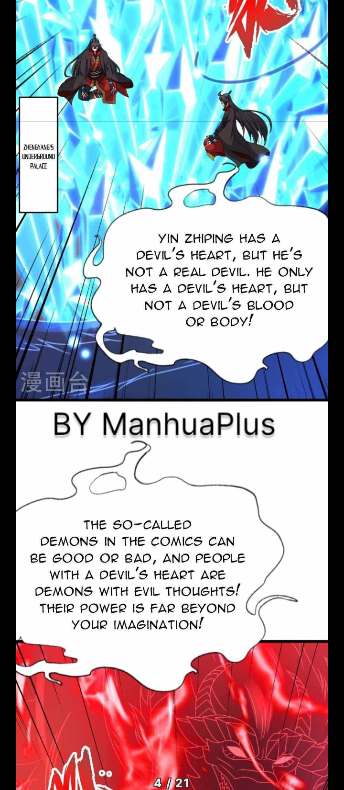
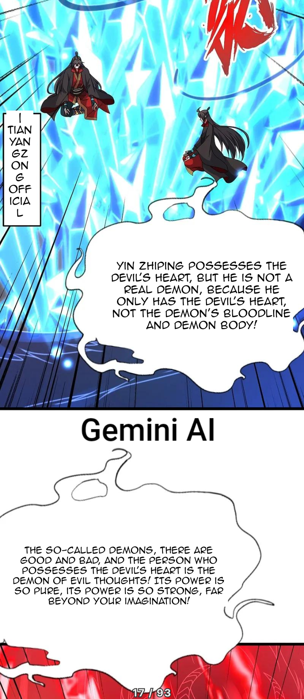
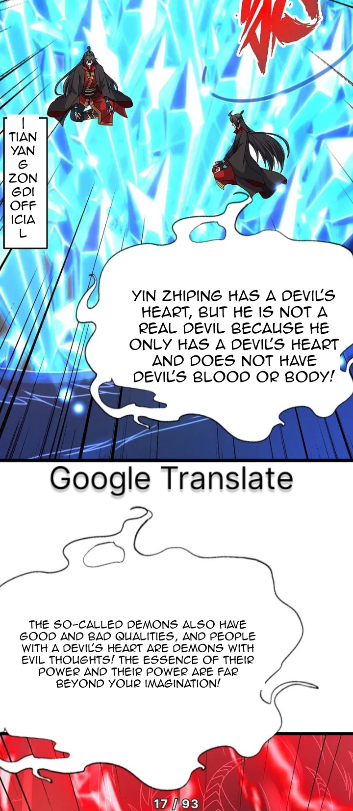
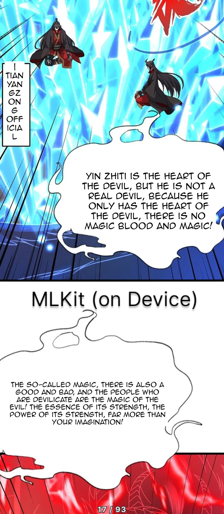

# TachiyomiSY + Auto Translations
TachiyomiSY is a free and open source manga reader for Android 6.0 and above. This version of TachiyomiSY, has a feature to automaticaly translate chapters on download

## Features
* All this Features of Original Mihon
* All this Features of TachiyomiSY

Newly Added :
* Automaticaly Translate Chapters on Download
* Change Text Font

## Supported Languages
* Chinese
* Korean
* Japanase

## Translation Comparison
Source : Banished Disciple's Counter Attack : Chapter 465
| ManhuaPlus  | Gemini | Google Translate  | MLKit (On Device) |
| ------------- | ------------- | ------------- | ------------- |
|   |   |   |   |

## Available Translators
* MLkit : On Device Translations
* Google Translate : Web Based
* Gemini : [Get API Key Here](https://makersuite.google.com/app/apikey "Get API Key Here")
* ChatGPT : [Get API Key Here](https://platform.openai.com/api-keys "Get API Key Here")

## Download
Get the app from our [releases page](https://github.com/mannu691/TachiyomiSY/releases/latest).

Pro Tip : Cola Manga is a good extension for raw manhua

**Currently Only "Long Strip" reader mode is working**
**Also "Save as CBZ Archive" option is not supported**
**please turn it off in Settings > Downloads > Save as CBZ Archive**
## Issues, Feature _Requests_ and Contributing

Please make sure to read the full guidelines. Your issue may be closed without warning if you do not.

Issues

1. **Before reporting a new issue, take a look at the [FAQ](https://tachiyomi.org/docs/faq/general), the [changelog](https://github.com/jobobby04/tachiyomisy/releases) and the already opened [issues](https://github.com/jobobby04/tachiyomisy/issues).**
2. If you are unsure, ask here: 

Bugs

* Include version (More → About → Version)
* If not latest, try updating, it may have already been solved
* Preview version is equal to the number of commits as seen on the main page
* Include steps to reproduce (if not obvious from description)
* Include screenshot (if needed)
* If it could be device-dependent, try reproducing on another device (if possible)
* Don't group unrelated requests into one issue

DO: https://github.com/tachiyomiorg/tachiyomi/issues/24 https://github.com/tachiyomiorg/tachiyomi/issues/71

DON'T: https://github.com/tachiyomiorg/tachiyomi/issues/75

Feature Requests

* Write a detailed issue, explaining what it should do or how. Avoid writing just "like X app does"
* Include screenshot (if needed)

Source requests are not accepted.

Contributing

See [CONTRIBUTING.md](./CONTRIBUTING.md).

Code of Conduct

See [CODE_OF_CONDUCT.md](./CODE_OF_CONDUCT.md).

## FAQ

[See our website.](https://mihon.app/)
